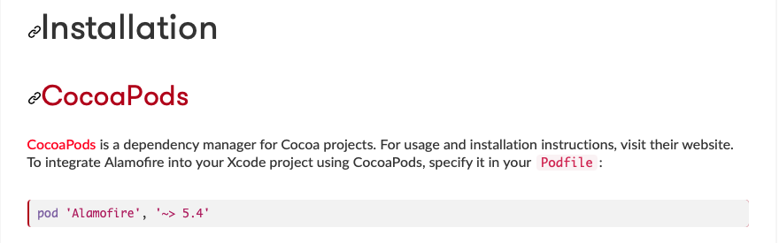

# 📚 CocoaPods

The most useful libraries and fithes with them 
### 💻 Cocoapods website - https://cocoapods.org

## 👶 First init
- Open terminal
- Open project directory.  
- Write this to terminal
-  Then write this
-   
-  Whait until cocoapods downloads.
-   
    
 

# ➕ How to add any library from cocoa pods   
### Search for the library on website cocoapods
  
                   
### Find and open your library
 
       
### Find instalation and copy string from there
  

### Open terminal and write - pod init
  

### Find your project inside Finder and open created file - Podfile
 

### Past string from website after second coment 
  

### go back to terminal and write - pod install 
  

### open project throw file .workspace, not throw .xcodeproject 
  

Thats it 

### Dont forget to import library inside your project 

  

