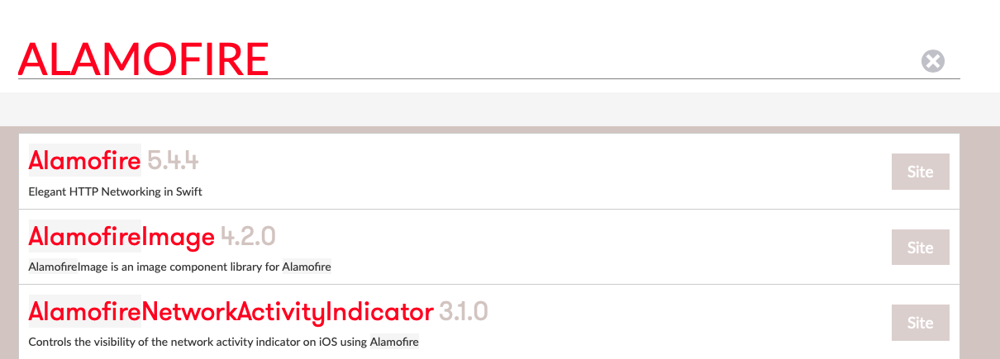
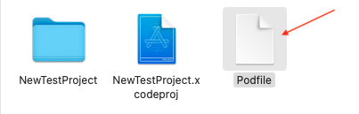
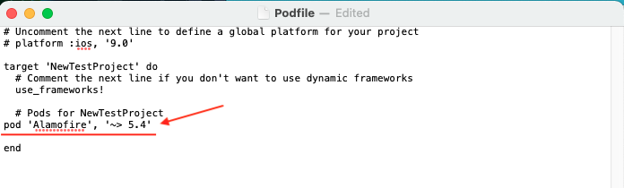
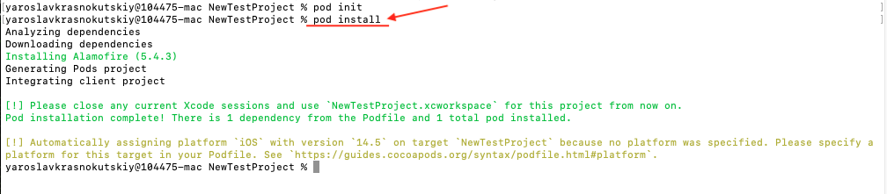
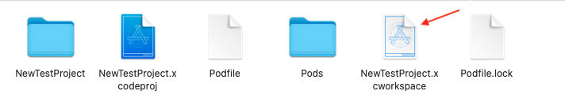

# CocoaPods

i will post the most usefull libraries from cocoapods 
and fieches with them.  
### Cocoapods website - https://cocoapods.org

## First init
- Open terminal
- Open project directory.  
- Write this to terminal
  
- Then write this
  
- Whait until cocoapods downloads.  

## How to add any library from cocoa pods   
serch
  

open inside site
     

pod init
     
pdfile image open podfile 
  
write string inside podfile 
   
pod instal into terminal
    
open workspace 
  

  
create podfile.  
      pod init.   
add string inside.     
  find string from cocoapods file      
  and put inside podfile        
  
close project.  
pod install.  
open project workspace.   
difference .workspace and .xcodeproj

  

